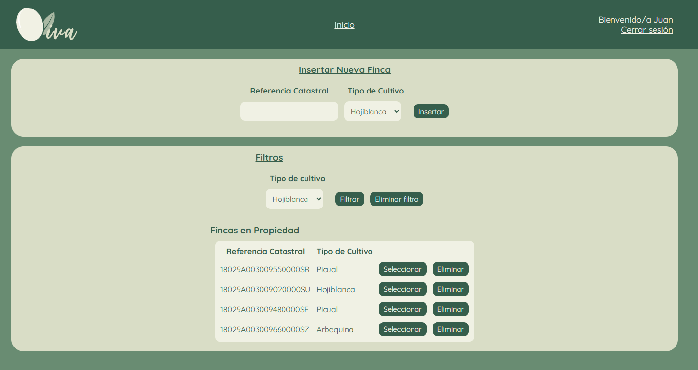
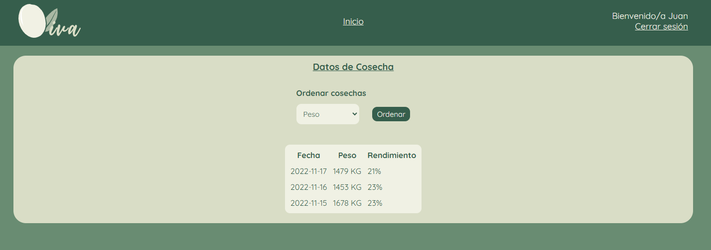
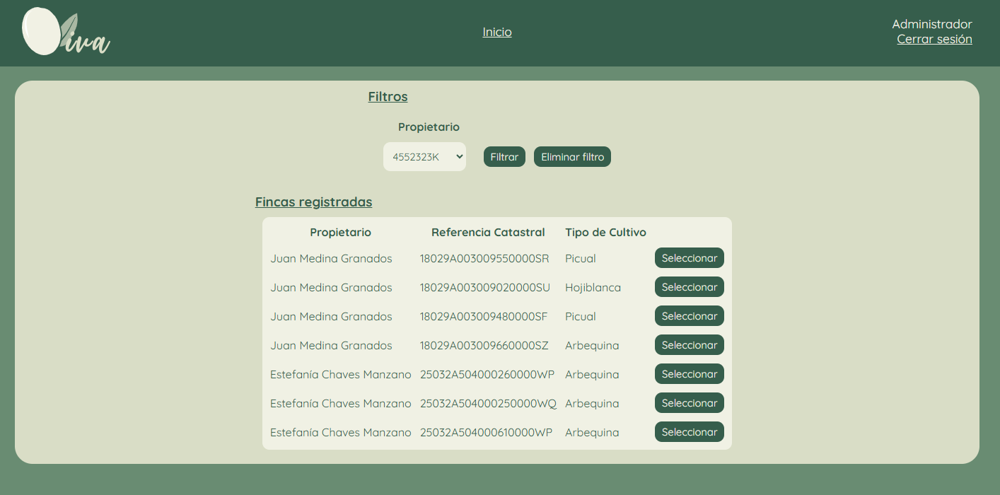
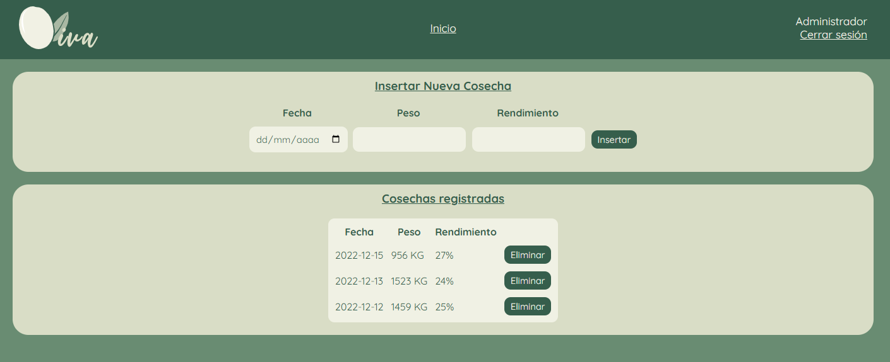

# Oliva
Proyecto final del ciclo formativo de grado superior de Desarrollo de Aplicaciones Web. Despliegue en local con XAMPP.

Se trata de un gestor de fincas con dos tipos de usuario: usuario registrado y administrador.

Los usuarios registrados pueden añadir fincas de olivos a su perfil, eliminarlas o filtrarlas por tipo de cultivo.

Al seleccionar una de las fincas, se pueden consultar los datos de las diferentes cosechas realizadas, pudiendo ordenaras según fecha, peso o rendimiento.

Desde el perfil del administrador, podremos comprobar las fincas existentes en la base de datos, así como filtrarlas según propietario.

Al seleccionar una de las fincas, tendremos la opción de añadir o eliminar los datos de la cosecha para que el usuario pueda consultarlos.

Tecnologías utilizadas:
- PHP
- SQL
- HTML
- CSS
- JavaScript

La defensa del proyecto se puede ver en el siguiente <a href="https://www.youtube.com/watch?v=n9RVbEX4GQQ">enlace</a>.
En ella, queda resumido el desarrollo del proyecto, con una demostración final de la aplicación.
